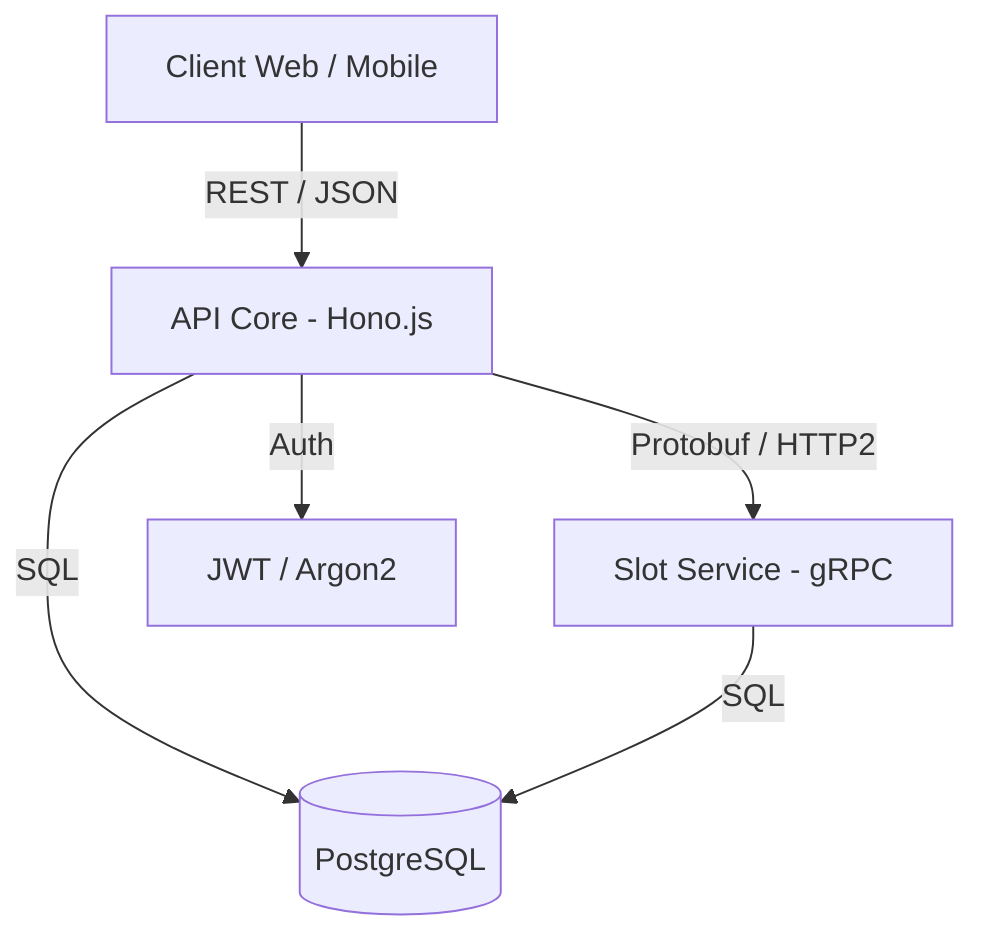

# 🩺 HealthSync: Plateforme de Prise de Rendez-vous Médicaux

Ce projet est une API de gestion de rendez-vous médicaux conçue pour la performance et la scalabilité, utilisant une architecture micro-services hybride (REST/gRPC).

## Structure du projet

```
HealthSync/
├── api/                    # Service REST principal
│   ├── src/
│   ├── tests/
|   └── swagger.yaml
├── grpc-service/           # Service gRPC
│   ├── proto/
│   └── src/
├── docs/
│   ├── rapport-owasp.pdf   # Rapport sécurité OWASP
│   ├── architecture.png    # Schéma de composants
│   ├── ADR_01.md               # Architecture Decision Record
│   └── presentation.pdf    # Support de soutenance
├── CONTRIBUTING.md         # Definition of Done + Git workflow
└── README.md
```

## Installation

Le projet utilise un **Makefile** pour simplifier la gestion des conteneurs Docker.

### Prérequis

- [Docker](https://docs.docker.com/get-docker/) & Docker Compose
- [Make](https://www.gnu.org/software/make/)

### Étapes d'installation

1. **Cloner le dépôt** :

   ```bash
   git clone https://github.com/votre-repo/HealthSync.git
   cd HealthSync
   ```

2. **Initialiser l'environnement** (création du `.env` et configuration des permissions) :

   ```bash
   make init
   ```

3. **Lancer les services** :
   ```bash
   make launch
   ```

### Documentation API

Une fois les services lancés (`make launch` ou `make start`), la documentation interactive de l'API REST est disponible sur :

http://localhost:3000/docs

### Commandes utiles

Le Makefile expose l'ensemble des opérations courantes. `make help` en affiche la liste complète avec leur description.

**Cycle de vie des conteneurs**

| Commande | Description |
| --- | --- |
| `make launch` | Construit si nécessaire et lance tous les services en arrière-plan. |
| `make start` | Démarre les conteneurs existants (ex : `make start s=api`). |
| `make stop` | Arrête temporairement les conteneurs (ex : `make stop s=api`). |
| `make restart` | Redémarre proprement un ou tous les conteneurs (ex : `make restart s=api`). |
| `make build` | Construit ou reconstruit les images. |
| `make rebuild s=<service>` | Force la reconstruction et la relance d'un service (ex : `make rebuild s=api`). |

**Observation et débogage**

| Commande | Description |
| --- | --- |
| `make ps` | Liste les conteneurs actifs et leur statut. |
| `make logs s=<service>` | Affiche les logs d'un conteneur en continu (ex : `make logs s=api`). |
| `make logs-all` | Affiche les logs de tous les conteneurs. |
| `make stats` | Affiche la consommation CPU et mémoire en temps réel. |
| `make exec s=<service>` | Ouvre un shell interactif dans un conteneur (ex : `make exec s=api`). |

**Tests**

Ces commandes supposent les conteneurs de base de données démarrés (`make launch` ou `make start`).

| Commande | Description |
| --- | --- |
| `make test-all` | Lance l'intégralité des tests : unitaires, intégration et end-to-end. |
| `make test` | Lance les tests en une passe, ciblés ou non (ex : `make test s=auth`). |
| `make test-watch` | Lance les tests en mode surveillance (ex : `make test-watch s=auth`). |
| `make test-coverage` | Lance les tests avec couverture de code et génère un rapport. |
| `make test-e2e` | Lance les tests end-to-end Cucumber (parcours complet de rendez-vous). |
| `make lint` | Vérifie la qualité du code avec le linter. |

**Base de données**

| Commande | Description |
| --- | --- |
| `make prisma-generate` | Génère le client Prisma localement. |
| `make prisma-migrate` | Applique les migrations Prisma à la base. |
| `make prisma-push` | Applique les migrations et génère le client. |

**Maintenance et remise à zéro**

| Commande | Description |
| --- | --- |
| `make remove` | Arrête les conteneurs et supprime les volumes associés. |
| `make remove-service s=<service>` | Arrête un service, supprime son conteneur et ses volumes (ex : `make remove-service s=api`). |
| `make restart-all` | Détruit les volumes et relance tout proprement. |
| `make clean-all` | Supprime conteneurs, réseaux et tous les volumes du projet. |
| `make clean` | Nettoie Docker des images, conteneurs et réseaux inutilisés. |

> Astuce : si une dépendance npm ajoutée en local ne semble pas prise en compte dans un conteneur, utilisez `make remove-service s=api` puis `make launch` — les `node_modules` vivent dans un volume Docker nommé qui n'est pas rafraîchi par un simple redémarrage.

## Architecture

Le système est divisé en deux composants principaux pour séparer les responsabilités :

1. API Gateway / Core (Hono.js) : Gère l'authentification, les utilisateurs, et l'orchestration des rendez-vous.
2. Slot Service (gRPC) : Service haute-performance dédié au calcul de la disponibilité des médecins.


